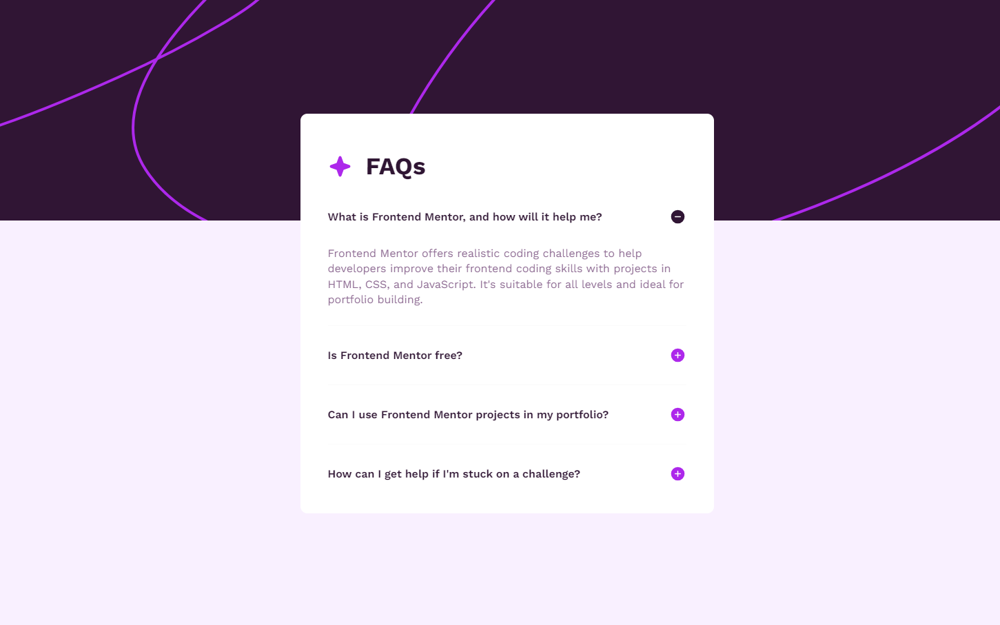

# Frontend Mentor - FAQ accordion solution

This is a solution to the [FAQ accordion challenge on Frontend Mentor](https://www.frontendmentor.io/challenges/faq-accordion-wyfFdeBwBz).

## Table of contents

- [The challenge](#the-challenge)
- [Screenshot](#screenshot)
- [Links](#links)
- [My process](#my-process)
  - [Built with](#built-with)
  - [What I learned](#what-i-learned)
  - [Continued development](#continued-development)
  - [Useful resources](#useful-resources)
- [Author](#author)
- [Acknowledgments](#acknowledgments)

### The challenge

Users should be able to:

- Hide/Show the answer to a question when the question is clicked
- Navigate the questions and hide/show answers using keyboard navigation alone
- View the optimal layout for the interface depending on their device's screen size
- See hover and focus states for all interactive elements on the page

### Screenshot

### Links

- Live Site URL: [FAQ Accordion](https://mahbt.github.io/faq-accordion/)

## My process

I started by analyzing the provided design and understanding the requirements for the FAQ accordion. Using the design as a guide, I built the HTML structure and styled it with CSS to match the given specifications. I then implemented JavaScript to add interactivity, allowing users to toggle FAQ answers and navigate using the keyboard. Throughout the development process, I tested the accordion across various devices and browsers to ensure responsiveness and accessibility. Finally, I deployed the project and verified that it met the design and functionality requirements.

### Built with

- Semantic HTML5 markup
- CSS custom properties
- Flexbox

## Author

- Frontend Mentor - [@mahbt](https://www.frontendmentor.io/profile/mahbt)
